# Nitra Take Home Project
Nitra Take Home Project. 

# Menu
* [Screenshots](#screenshots)
* [Tech](#Tech)
* [Source](#source)
* [Contact](#contact)

# Screenshots

* Main Page
  
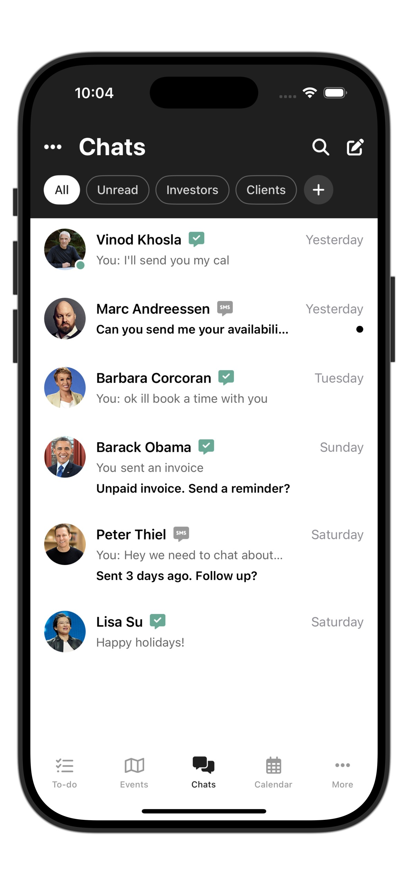  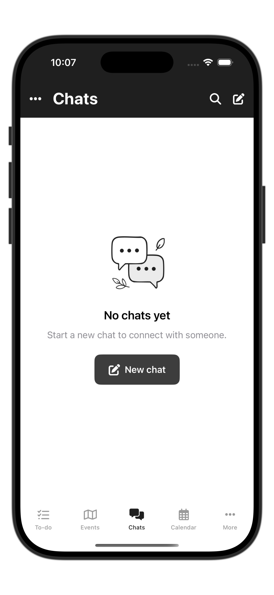
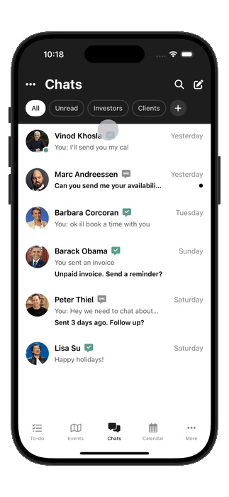

* Loading/Alert/Launch Screen/More

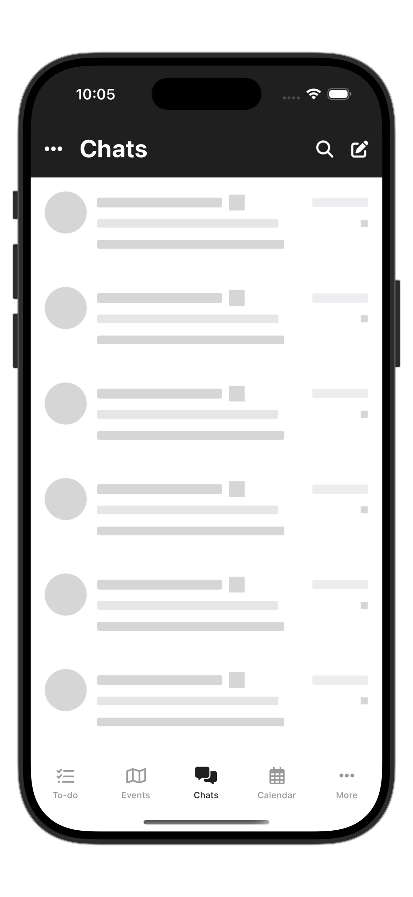 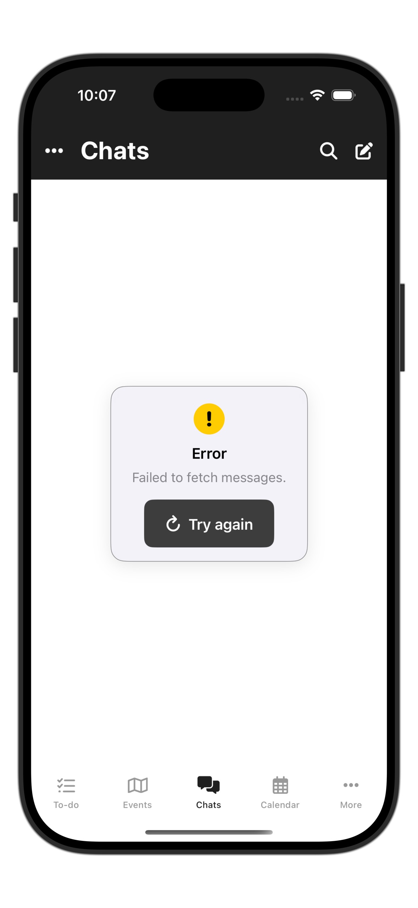 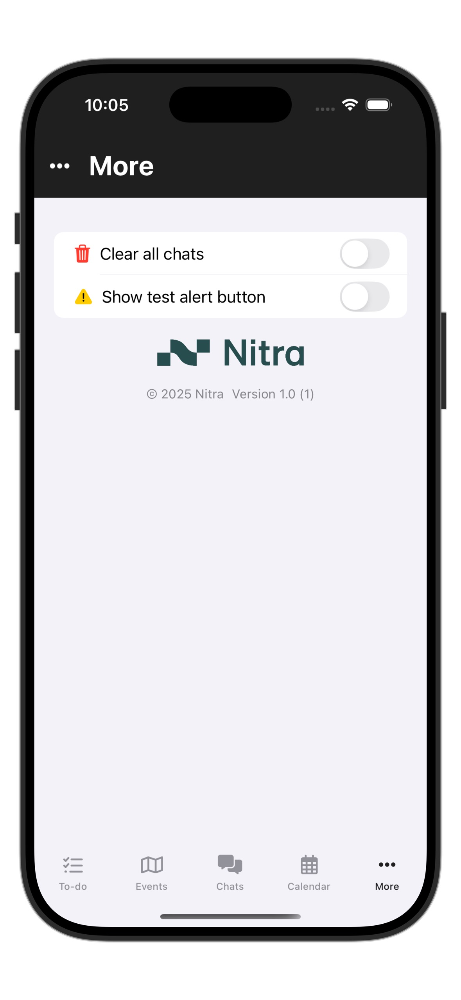 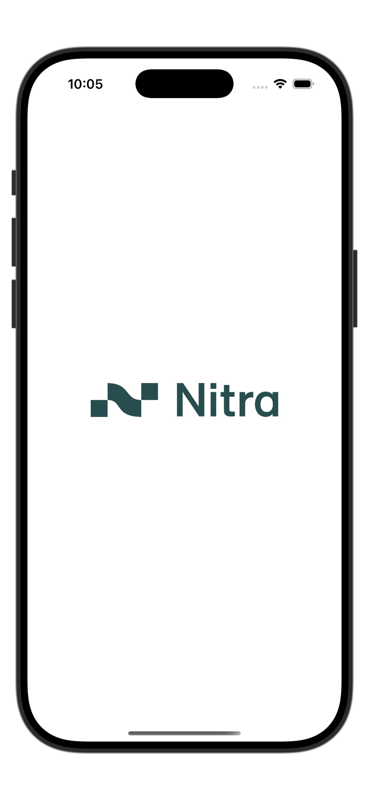

* Dark Mode

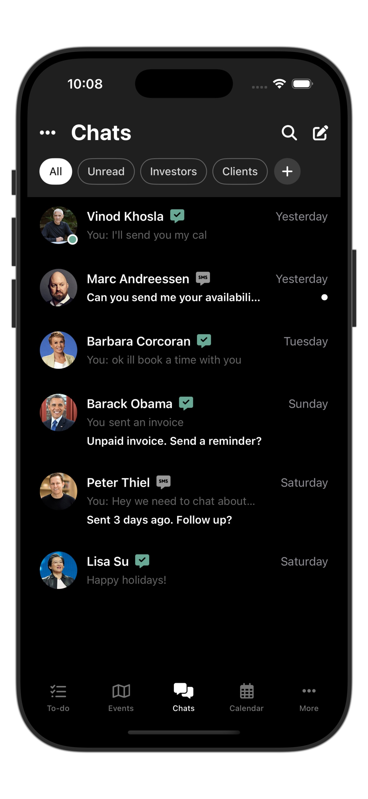 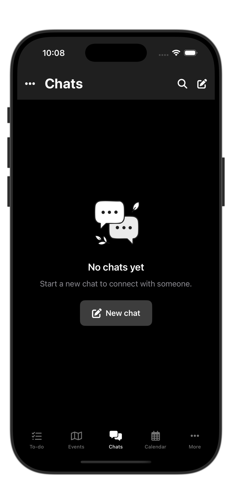 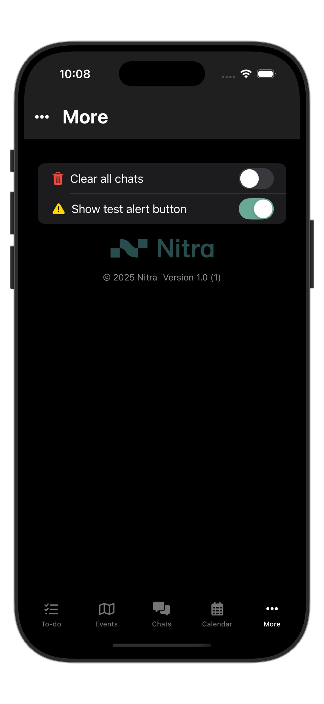 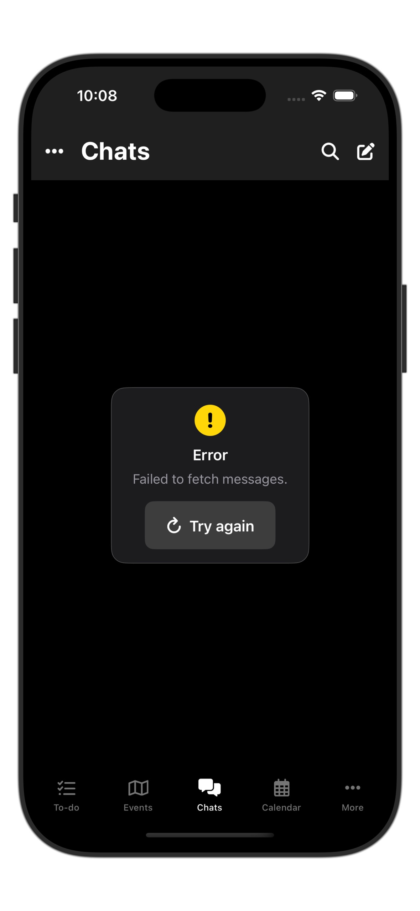

# Tech

* Open specific tab first opening
* Chat filter + animations
* Custum alert
* Chatroom redacted loading view
* Chatroom empty state view
* Smooth transition
* Darkmode supported
* Light/Dark/Tinted App Icons
* No third party libraries

# Source

### Library

No third party library.

# Contact
Created by [Terry Kuo](https://bento.me/terrykuo)
